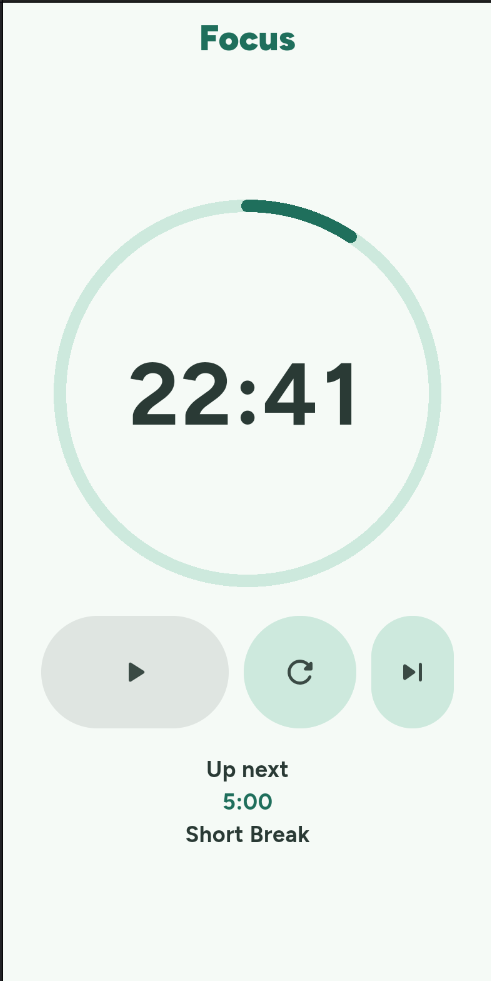

# Pomodoro

App de Pomodoro feito em Flutter, com visual limpo e animações suaves.

<!-- Troque o caminho abaixo pela sua imagem, ex.: assets/screenshots/home.png -->

  

## Funcionalidades

- Timer de foco (25:00) e pausa curta (5:00)
- Iniciar/pausar, reiniciar e pular sessão
- Anel de progresso animado
- Dígitos com animação de rolagem
- Indicador "Up next"

## Tecnologias

- Flutter (Material 3)
- google_fonts (Figtree)

## Como rodar

    flutter pub get
    flutter run